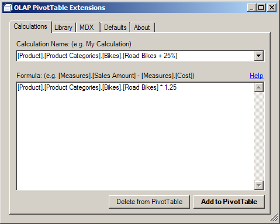
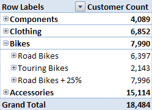

### Calculations Help

This page is a resource for the OLAP PivotTable Extensions if you are creating private PivotTable calculations and need help. The formula used is a standard Analysis Services MDX expression. All formulas are executed on the Analysis Services server.

The best place to ask for help with MDX expressions is at the [MDX tag on StackOverflow](http://stackoverflow.com/questions/tagged/mdx) or the [Microsoft Analysis Services Forums](http://social.msdn.microsoft.com/forums/en-US/sqlanalysisservices/threads/).

#### Example Calculations 

The following calculations work against Microsoft's sample Adventure Works cube:

##### Ratio 
{{
IIf(
 [Measures](Measures).[Internet Order Count](Internet-Order-Count) = 0
 ,null
 ,[Measures](Measures)(Measures).[Internet Tax Amount](Internet-Tax-Amount) / [Measures](Measures)(Measures).[Internet Order Count](Internet-Order-Count)
)
}}

#### MDX References

* [MDX Function Reference](http://msdn2.microsoft.com/en-us/library/ms145970.aspx)
* [MDX Function Usage Examples](http://www.mdxpert.com)
* [VBA functions](http://msdn2.microsoft.com/en-us/library/aa178230(SQL.80).aspx) you can use in MDX expressions.
* If Excel 2003 or later is installed on the Analysis Services server, these [Excel functions](http://msdn2.microsoft.com/en-us/library/aa178231(SQL.80).aspx) can be used in your MDX expressions.

#### Advanced

The following are advanced tricks that may require more advanced knowledge of Analysis Services, your cube, and MDX.

#### Calculated Members on Dimensions

If you type in simply "My Calculation" or "{"[Measures](Measures).[My Calculation](My-Calculation)"}" into the Calculation Name field in Calculations tab of OLAP PivotTable Extensions, you are creating a calculated measure. Calculations can also be placed on dimensions. This is appropriate when the calculation applies across to all measures.

As an example, you could define the following calculation:
* Calculation Name: {{[Product](Product).[Product Categories](Product-Categories).[Bikes](Bikes).[Road Bikes + 25%](Road-Bikes-+-25%)}}
* Formula: {{[Product](Product).[Product Categories](Product-Categories).[Bikes](Bikes).[Road Bikes](Road-Bikes) * 1.25}}

These dimension calculated members then show up in the PivotTable just like normal dimension members:

#### {"NON_EMPTY_BEHAVIOR"}

The formula you provide for a calculation can include the {"NON_EMPTY_BEHAVIOR"} property which is a performance hint for MDX query execution on the server. While this property can drastically improve performance, do not use it unless you know what you're doing as it will cause incorrect numbers to be returned if you use it incorrectly. You may want to have your Analysis Services administrator check your calculations and {"NON_EMPTY_BEHAVIOR"} settings by exporting and sending him/her your Calculations Library.

For more information on {"NON_EMPTY_BEHAVIOR"} in Analysis Services 2005 see the [Performance Guide](http://www.microsoft.com/technet/prodtechnol/sql/2005/ssas2005perfguide.mspx) and search for "NEB". Do not include a {"NON_EMPTY_BEHAVIOR"} if your PivotTable is running off an Analysis Services 2008 cube.

You can also set the {"FORMAT_STRING"}, {"BACK_COLOR"}, and {"FORE_COLOR"} properties (though since you can format the data in the PivotTable with native Excel functionality, this isn't strictly necessary). You may also set the SOLVE_ORDER property for situations when multiple calculations intersect on a particular cell.

The following is an example of setting such properties:

{{
[Measures](Measures)(Measures).[Internet Tax Amount](Internet-Tax-Amount) / [Measures](Measures)(Measures).[Internet Order Count](Internet-Order-Count)
,NON_EMPTY_BEHAVIOR = [Measures](Measures).[Internet Tax Amount](Internet-Tax-Amount)
,FORMAT_STRING = "$#,##0"
}}

#### Putting Calculations in Folders (AS2008 only)

When you build a private calculation in a PivotTable, it goes in the Values folder at the top of the field list. If your server is Analysis Services 2008, you can put that measure into a subfolder in the Values folder by using the DISPLAY_FOLDER property:

{{
[Measures](Measures).[Internet Sales Amount](Internet-Sales-Amount) * 2
,DISPLAY_FOLDER = 'My Folder'
}}

Or you could put it in the folder for a measure group:

{{
[Measures](Measures).[Internet Sales Amount](Internet-Sales-Amount) * 2
,ASSOCIATED_MEASURE_GROUP = 'Internet Sales'
}}

Or you could put it in a subfolder inside a particular measure group:

{{
[Measures](Measures).[Internet Sales Amount](Internet-Sales-Amount) * 2
,DISPLAY_FOLDER = 'My Folder'
,ASSOCIATED_MEASURE_GROUP = 'Internet Sales'
}}

#### AS2000 Syntax

For PivotTables running off an Analysis Services 2000 cube, note that the syntax for calculated members in AS2000 was less flexible. You must surround your entire MDX with single quotes like:

{{
'[Measures](Measures)(Measures).[Internet Tax Amount](Internet-Tax-Amount) / [Measures](Measures)(Measures).[Internet Order Count](Internet-Order-Count)'
}}

#### PowerPivot

For PowerPivot, here is the official policy. If it's not done using the Excel UI, it's not supported by Microsoft. So using OLAP PivotTable Extensions (which uses the Excel API) won't be supported by Microsoft. So use OLAP PivotTable Extensions on top of PowerPivot PivotTables at your own risk.

That being said, using OLAP PivotTable Extensions to add calculations to a PowerPivot PivotTable works fine most of the time. It lets you do things which are not possible with PowerPivot itself, for example, adding calculated members to dimensions (so that the calculation applys to every measure).

Note the Solve_Order workaround mentioned in the following discussion [discussion:219957](discussion_219957). Also note the tips on troubleshooting DAX errors in PowerPivot mentioned in that discussion. Finally, note that the calculations you can add in OLAP PivotTable Extensions are MDX calculations, not DAX calculations.

Unfortunately, PowerPivot for Excel 2013, which comes installed with Excel, but has to be activated under COM Add-ins, has removed the ability add MDX calculations to PivotTables. For more about Excel 2013 and the Excel Data Model, see the [Excel 2013](Excel-2013) page.